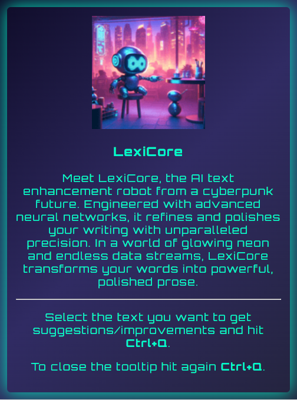
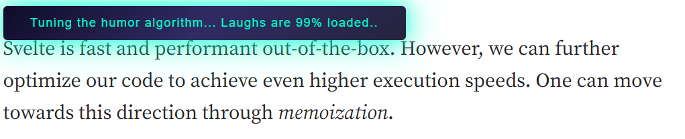
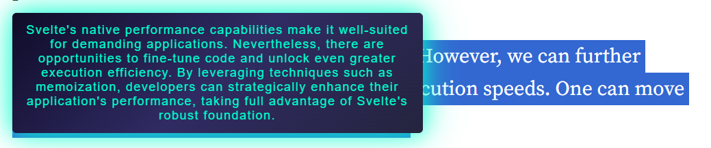

## LexiCore: Your AI Text Enhancement Companion

  

**LexiCore** is an **AI-powered text enhancement tool** straight out of a cyberpunk future. Designed with cutting-edge neural networks, LexiCore takes your writing and elevates it to a new level of clarity and impact. In a world dominated by glowing neon lights and endless data streams, LexiCore becomes your ally in crafting powerful, polished prose.

Powered by the advanced Llama 3.1 model, this Chrome extension seamlessly integrates into your workflow. With a simple text highlight and a quick **Ctrl + Q**, LexiCore analyzes your selected text and offers an enhanced version in real time. Whether you're drafting an email, creating a blog post, or finalizing a report, LexiCore provides AI-driven improvements at the touch of a button.

---

## ✨ Key Features

- **Instant Text Enhancement**: Highlight text and press **Ctrl + Q** to get refined, concise, and impactful versions instantly.
- **Powered by Llama 3.1**: Utilizes the latest advancements in AI language models for top-tier results.
- **Seamless Integration**: Works effortlessly within any DOM text in Chrome—perfect for emails, articles, reports, and more.
- **Minimalist Interface**: Easy-to-use popup with all the controls you need without the clutter.

## 🚀 Use Cases

LexiCore is perfect for a variety of writing scenarios, including but not limited to:

- **Emails and Professional Communication**: Enhance clarity and tone.
- **Content Creation**: Optimize blog posts, articles, and marketing copy.
- **Academic Writing**: Refine essays, reports, and research papers.
- **Social Media**: Create impactful posts and responses.

### 📖 How It Works

1. **Open the LexiCore Popup**: Click on the extension icon to view details and settings.
   

     
   

2. **Select Text and Press Ctrl + Q**: Highlight the text you want to enhance and hit **Ctrl + Q**. LexiCore will instantly process the text and provide a refined version.
   

     
   

   

     
   

## 🛠 Installation

### 1. Ollama

To use LexiCore you'll need Llama 3.1. For those who prefer using Ollama, follow these [instructions](https://github.com/ollama/ollama) to set up LexiCore seamlessly.

### 2. Chrome Extension

You can easily install LexiCore by loading the contents of this repo. For more details check these [instructions](https://developer.chrome.com/docs/extensions/get-started/tutorial/hello-world#load-unpackedv).

## 🌐 Contributing

We welcome contributions from the community! If you'd like to contribute to LexiCore, please follow these steps:

1. **Fork the Repository**: Click the **Fork** button in the top right corner of this page.
2. **Create a New Branch**: Use `git checkout -b feature/YourFeatureName`.
3. **Commit Your Changes**: Use descriptive commit messages for better tracking.
4. **Submit a Pull Request**: Ensure your pull request includes a clear description of changes.

## 📄 License

LexiCore is open source under the [MIT License](https://github.com/gkamtzir/LexiCore/blob/main/LICENSE). You are free to use, modify, and distribute this software as per the license terms.

## 📧 Contact

For any queries, issues, or feature requests, feel free to open an issue on GitHub.

---

